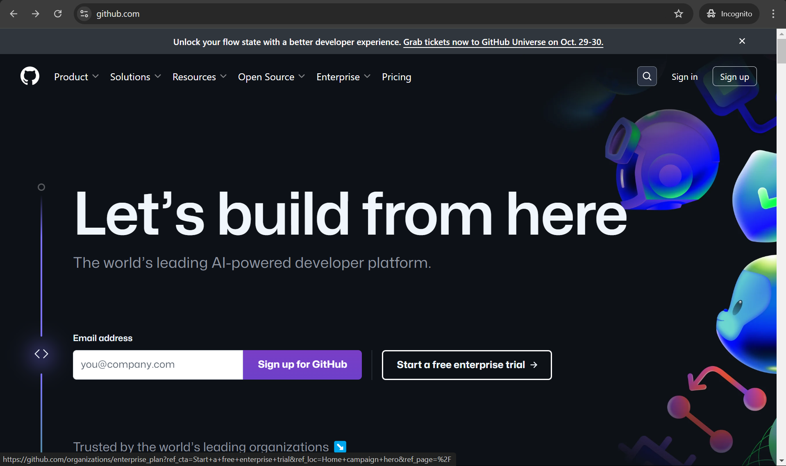
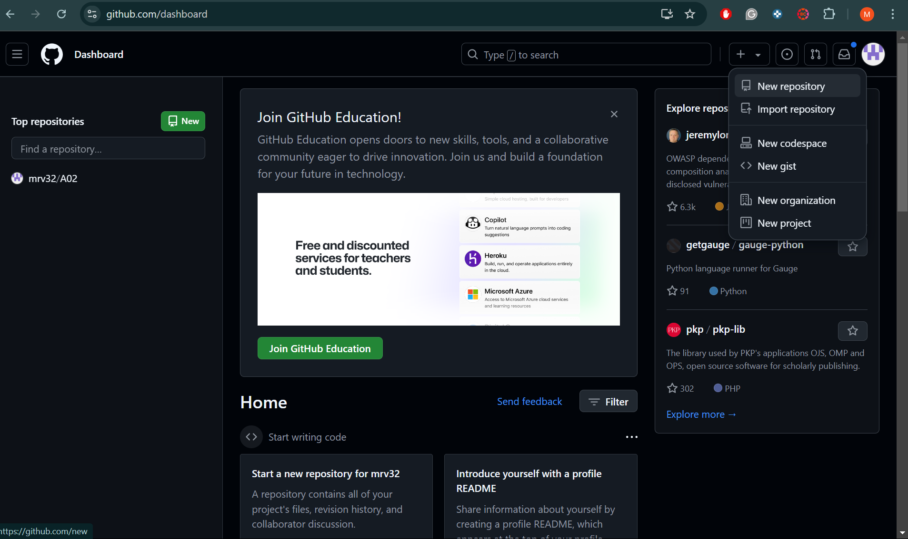
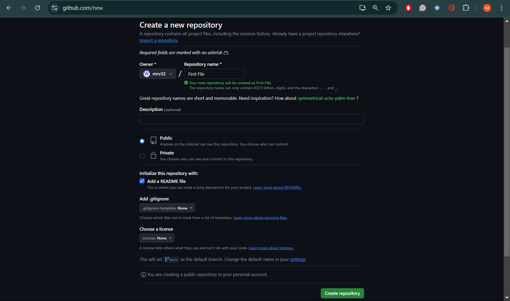
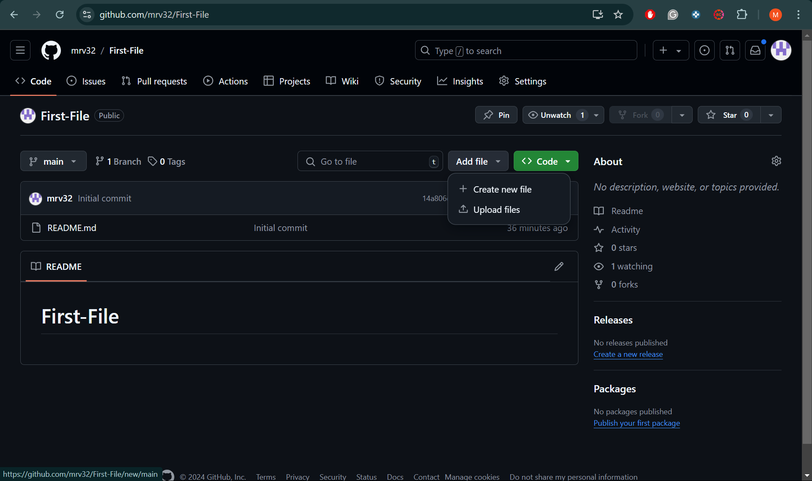
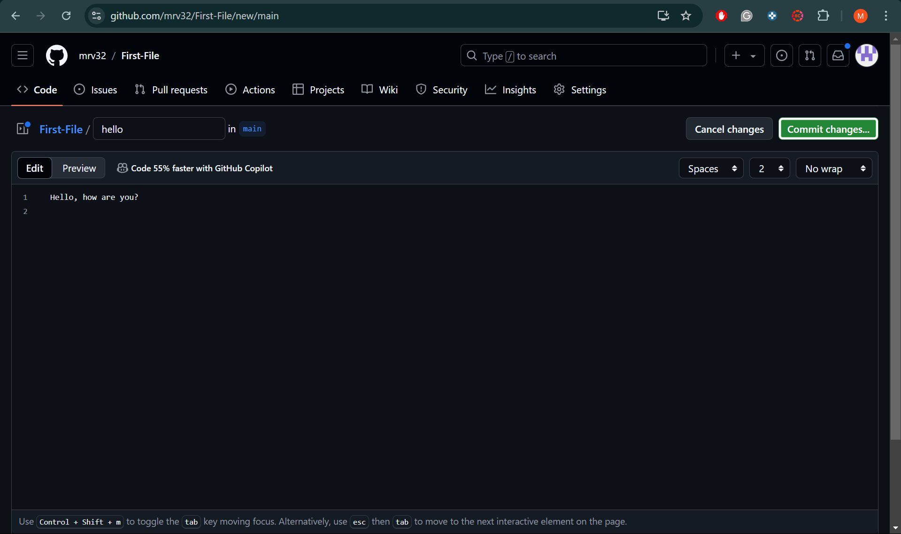
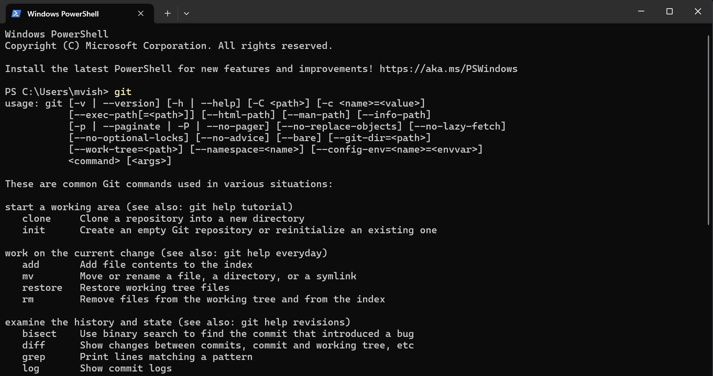

# A02 

# Git & GitHub: Step by Step Tutorial

## Step 1: Create a GitHub account

Start off by going to github.com and signing up for an account. Use whichever email or username you want, as long as you reach the homescreen.

## Step 2: Create Your First Repository

A repository is where you will store your projects and also where you can collabarate with others. 

Name your repository what you would like. IF you are doing a project, make sure it relates to it. You can also check the box for a README file if you would like to add a description for your repository. 

## Step 3: Create/Upload A File

You can choose to either create a new file or upload one from your computer. When creating a new file, you will need a name for your file and the you can begin coding. 

## Step 4: Commiting Changes

When commiting your changes, you can add a brief description on what you added or changed from your code.

# Accessing Git
Git is what GitHub uses for their social and user interface. If you have open-source projects that use Git, GitHub is designed to help you better manage them. By using the link, https://git-scm.com/downloads you can download Git.

Search Terminal on your computer and type "git". This will prompt the screen to give you many commands on using Git. 

# Webstorm 

Webstorm is mainly used for Javascript and Typescript. It also has other languages like CSS, HTML, etc. It is utalized for creating, editing, and debuging coding. By going to https://www.jetbrains.com/webstorm/, you are able to download it and learn more about it. Webstrom also supports multiple frameworks and libraries like Angular, React, Vue.js, and Node.js. 

# Glossary

- **Branch**: A branch is a new or parallel version of the main repository. If you are working on a project that's too big or has an error, a branch of that repository will allow you edit and fix the problem without effecting the main repository. 
- **Clone**: Creates a full copy of your chosen repository from GitHub. This includes all the data, different versions, and folders from the repository.  If you choose to edit on a different editor, you can use Git to track your changes while being able to edit offline.
- **Commit**: A commit is meant to record and save your coding from one or multiple files in your branch. A breif description is usually added describing what was changed.
- **Fetch**: This command (git fetch) allows you to obtain the latest work completed by your other partners. It will be able to download commits, files, and refs from a remote repository into your local repository. Those changes wont't effect your own branches. 
- **GIT**: an open source program mainly used to track changes of in text files. GitHub uses this for their social and user interface.
- **Github**: Cloud-based platform where you can work on coding individually or in groups while also being able to share it with other users. 
- **Merge**: Merge allows the changes from one branch to be applied to another. This is related to when the "pull request" is utalized from GitHub.
- **Merge Conflict**: A problem that arises from merged branches. If the coding was disrupted or changed in some way, it would need to be fixed before the branches can merge.
- **Push**: Sending your commited changes to a remote repository on GitHub. If something is changed locally, it can be pushed so others can see what you changed.
- **Pull**: When you fetch and merge changes. If you have a local copy of your remote file and someone edits it, you would pull those edits or changed made.
- **Remote**: The version of a repository or branch that is being hosted on a server like GitHub. 
- **Repository**: Basically a project's folder. It will store all of the project's files and their revision history.

# References

- https://docs.github.com/en/get-started/start-your-journey/about-github-and-git
- https://www.w3schools.com/git/git_branch.asp?remote=github#:~:text=In%20Git%2C%20a%20branch%20is,update%20the%20design%20on%20it
- https://docs.github.com/en/repositories/creating-and-managing-repositories/cloning-a-repository
- https://docs.github.com/en/desktop/making-changes-in-a-branch/committing-and-reviewing-changes-to-your-project-in-github-desktop#:~:text=Similar%20to%20saving%20a%20file,Who%20created%20the%20changes
- https://www.atlassian.com/git/tutorials/syncing/git-fetch#:~:text=The%20git%20fetch%20command%20downloads,else%20has%20been%20working%20on.
https://docs.github.com/en/get-started/learning-about-github/github-glossary#git
https://devmountain.com/blog/git-vs-github-whats-the-difference/#:~:text=Simply%20put%2C%20Git%20is%20a,help%20you%20better%20manage%20them.
https://www.jetbrains.com/webstorm/
https://git-scm.com/downloads
